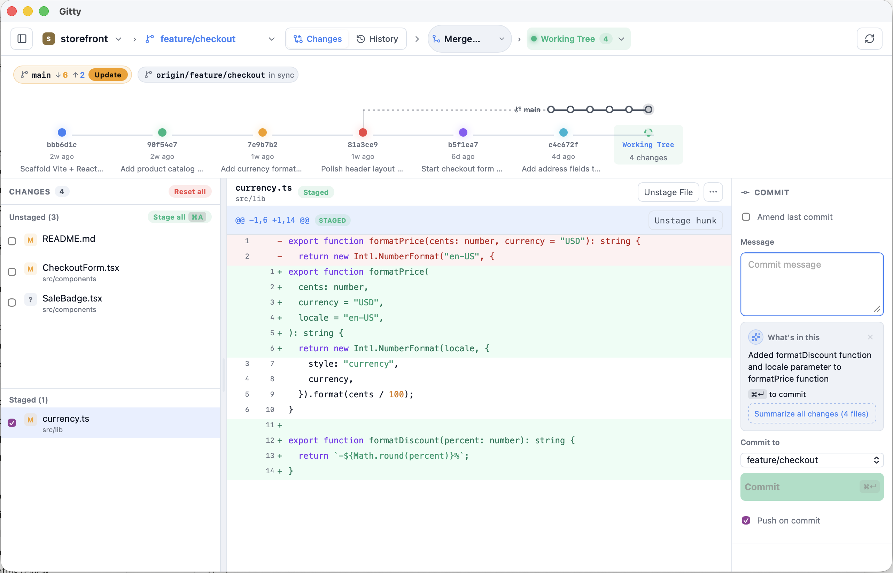
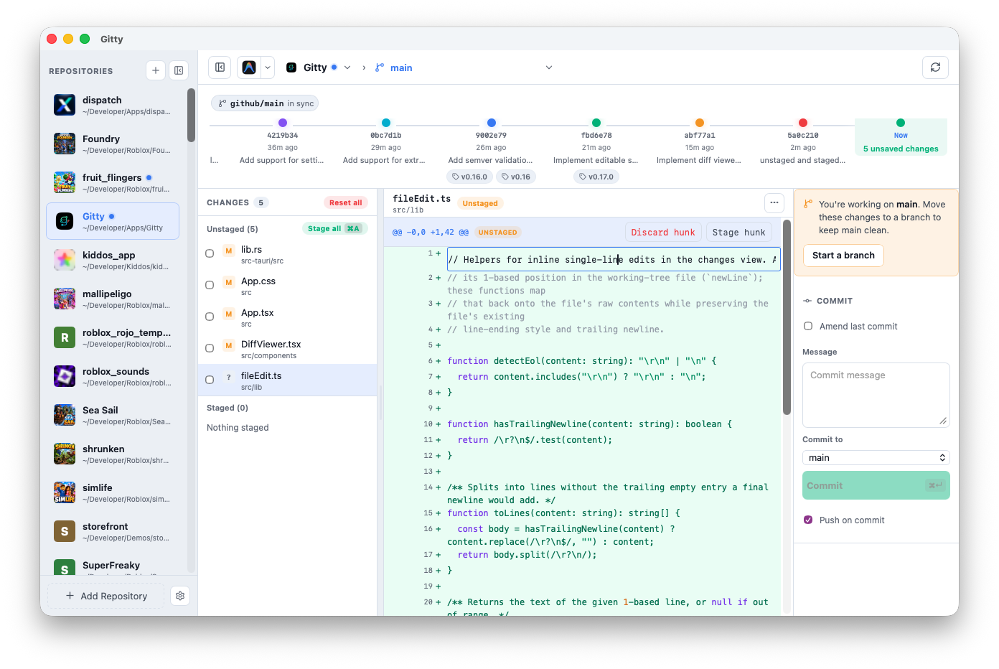
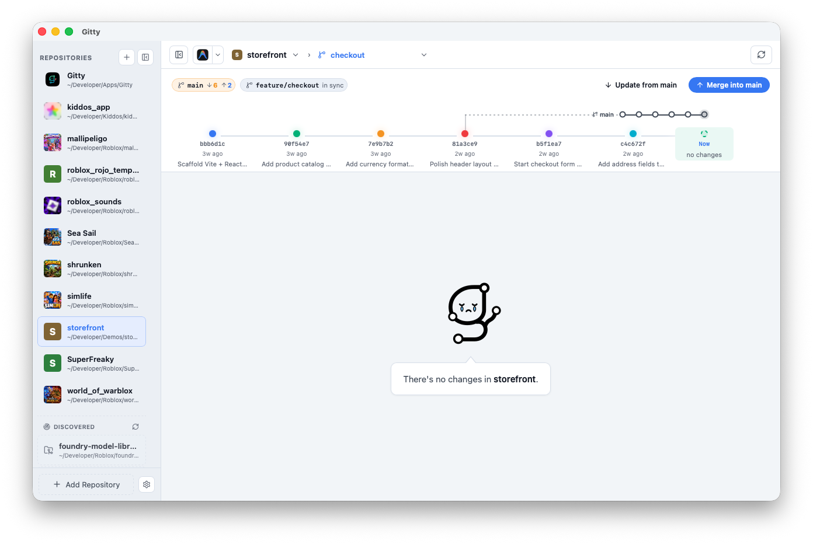

# Gitty

**Fast, keyboard-driven Git for macOS, Windows, and Linux.** Stage, review, commit, and push without leaving the keyboard. Gitty is a cross-platform native [Tauri](https://tauri.app/) app — lightweight, instant to open, and built to stay out of your way.

No Electron bloat. No background polling. No embedded Git library. Gitty calls your system `git` directly and refreshes only when you need it — select a repo, hit refresh, or finish an action. The result is a client that feels snappy on large repos and stays responsive all day.



## Why Gitty

- **Keyboard-first** — The whole workflow is built around keybinds. Stage everything, write a message, commit, and push without touching the mouse.
- **Blazing fast** — Native shell, on-demand refreshes, and zero idle overhead. Open a repo and you're looking at diffs immediately.
- **Free AI commit summaries** — Bring your own [NVIDIA API key](https://build.nvidia.com/models) and get commit message suggestions at no extra cost from Gitty. NVIDIA's free tier covers typical usage; your key stays local.
- **Dead simple** — Saved repo catalog, one-click discovery, syntax-highlighted diffs, push with `--force-with-lease`. Everything you need, nothing you don't.

## The keyboard workflow

Gitty is designed to be driven from the keyboard. Most of your day looks like this:

1. `Enter` — jump to the commit message
2. `Mod A` — stage all changes
3. `Mod Enter` — commit (or apply an AI summary and commit in one shot)
4. `Mod Shift Enter` — push

Navigate the timeline and file list with arrow keys. Switch repos, branches, and views from the top bar when you need to — but the core loop never requires a mouse.

| Shortcut | Action |
| --- | --- |
| `Enter` | Focus the commit message field |
| `Mod Enter` | Commit staged changes, or apply AI summary and commit |
| `Mod Shift Enter` | Push |
| `Mod A` | Stage all changes |
| `↑` / `↓` | Move selection in the timeline or file list |
| `←` / `→` | Move between commits on the timeline |

`Mod` is `⌘` on macOS and `Ctrl` on Windows and Linux.

## Free commit summarization

Gitty can draft commit messages from your staged changes using [NVIDIA NIM](https://build.nvidia.com/models) (Llama 3.1 8B Instruct). It's **free to use** — just bring your own NVIDIA API key:

1. Get a free key at [build.nvidia.com/models](https://build.nvidia.com/models)
2. Open **Settings** (sidebar gear icon) and paste it in
3. Toggle **Auto summarize** to get suggestions as you stage, or trigger them manually from the commit panel
4. Hit `Mod Enter` to accept a suggestion and commit in one step

No Gitty subscription. No usage fees from us. Your key is stored locally in the app config directory.

Summaries are generated from staged diff content sent to NVIDIA's API — only enable this if you're comfortable with that.

## Features

### Repository management
- Saved catalog of local Git repositories
- Scan common folders for recently edited repos and add them in one click
- Per-repo icons, sidebar switching, branch picker in the top bar

### Working tree
- Staged and unstaged file lists with syntax-highlighted unified diffs
- Stage, unstage, or discard all changes
- Amend the previous commit

### History
- Graph timeline and tabular history view
- Inspect any commit's files and full diff
- Soft or hard reset to a selected commit
- Ahead/behind counts relative to upstream



The working-tree timeline keeps branch context in view: how far ahead and behind you are of `main` and your upstream, with ghost commits showing what you'd pull in.



### Remotes and push
- Add, update, or remove remotes from repo settings
- Push in one action; force push with `--force-with-lease` when needed

## Requirements

- **macOS 11+**, **Windows 10+**, or a recent **Linux** desktop
- **Git** on `PATH`
- For development: [Node.js](https://nodejs.org/) 18+ and [Rust](https://www.rust-lang.org/tools/install) (stable)

## Development

```bash
npm install
npm run tauri dev
```

## Project structure

```text
src/                  React frontend (TypeScript + Vite)
  components/         UI panels, sidebar, diff viewer, etc.
  lib/                Git helpers, diff parsing, timeline navigation
src-tauri/            Rust backend (Tauri commands)
  src/lib.rs          Git operations invoked from the frontend
  src/discovery.rs    Background repo scanning
  src/summarize.rs    NVIDIA API commit message generation
  src/settings.rs     App settings persistence
scripts/              macOS release signing helpers
```

## Checks

```bash
npm run build
cd src-tauri && cargo check
```

## Release build

Build for your current platform:

```bash
npm run tauri build
```

Tauri writes bundles under `src-tauri/target/release/bundle/` — for example `.app` / `.dmg` on macOS, `.msi` / `.exe` on Windows, and `.deb` / `.AppImage` on Linux (exact formats depend on your OS and Tauri config).

### Windows release

Build on a Windows machine:

```powershell
npm install
npm run build:windows
```

Installers are written to `src-tauri/target/release/bundle/` — an NSIS `.exe` setup and an `.msi`.

To publish a GitHub release from CI, push a version tag. The tag becomes the GitHub release name, and CI syncs it into `package.json`, `tauri.conf.json`, and `Cargo.toml` before building:

```bash
git tag v0.1.1
git push github v0.1.1
```

Or run the **Release Windows** workflow manually from the Actions tab and enter the tag (for example `v0.1.1`).

The git tag and the app version should match. If you tag `v0.1.1` but leave the app version at `0.1.0`, older workflow versions would rebuild installers and attach them to the wrong release.

### Signed + notarized macOS release

For distribution outside the App Store, use a **Developer ID Application** certificate (not the App Store "Apple Distribution" cert).

1. Create the certificate at [Apple Developer → Certificates](https://developer.apple.com/account/resources/certificates/list): **Developer ID Application**.
2. Download the `.cer` file and double-click it to install in Keychain.
3. Confirm the identity name:

```bash
security find-identity -v -p codesigning
```

4. Create an app-specific password at [appleid.apple.com](https://appleid.apple.com/account/manage) (Sign-In and Security → App-Specific Passwords).
5. Copy the env template and fill in your values:

```bash
cp .env.macos-signing.example .env.macos-signing.local
```

6. Build, sign, notarize, and staple in one step:

```bash
npm run build:macos
```

Tauri signs the app during bundling, submits it to Apple for notarization, then staples the ticket to the `.app` and `.dmg`.

Verify the result:

```bash
spctl -a -vv --type execute src-tauri/target/release/bundle/macos/Gitty.app
xcrun stapler validate src-tauri/target/release/bundle/macos/Gitty.app
```
