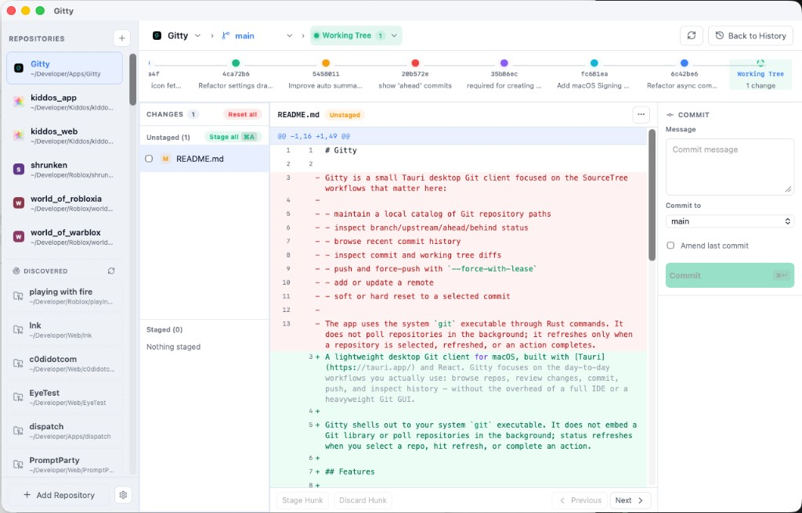

# Gitty

A lightweight desktop Git client for macOS, built with [Tauri](https://tauri.app/) and React. Gitty focuses on the day-to-day workflows you actually use: browse repos, review changes, commit, push, and inspect history — without the overhead of a full IDE or a heavyweight Git GUI.

Gitty shells out to your system `git` executable. It does not embed a Git library or poll repositories in the background; status refreshes when you select a repo, hit refresh, or complete an action.



## Features

### Repository management
- Maintain a saved catalog of local Git repositories
- Scan common folders for recently edited repos and add them with one click
- Per-repo icons derived from the repository contents
- Switch repos from the sidebar or top bar

### Working tree
- View staged and unstaged changes in a split file list
- Stage and unstage individual files or everything at once
- Syntax-highlighted unified diffs for working tree and commit changes
- Discard all local changes (tracked and untracked)
- Amend the previous commit

### History
- Browse recent commits in a graph timeline or tabular history view
- Inspect any commit's file list and full diff
- Soft or hard reset to a selected commit
- See ahead/behind counts relative to upstream

### Remotes and push
- Add, update, or remove remotes from repo settings
- Push with a single action
- Force push with `--force-with-lease` when the remote has diverged

### AI commit summaries (optional)
- Generate concise commit message suggestions from staged changes
- Powered by [NVIDIA NIM](https://build.nvidia.com/models) (Llama 3.1 8B Instruct)
- Enable auto-summarize in app settings, or trigger summaries manually from the commit panel
- Requires an NVIDIA API key; stored locally in the app config directory

## Requirements

- **macOS 11+** (primary target; Tauri can build for other platforms)
- **Git** installed and available on `PATH`
- For development:
  - [Node.js](https://nodejs.org/) 18+
  - [Rust](https://www.rust-lang.org/tools/install) (stable)
  - Xcode Command Line Tools (`xcode-select --install`)

## Development

```bash
npm install
npm run tauri dev
```

The Vite dev server runs on port 1420; Tauri opens a native window pointed at it.

## Keyboard shortcuts

| Shortcut | Action |
| --- | --- |
| `Enter` | Focus the commit message field (working tree view) |
| `⌘ Enter` | Commit staged changes, or apply an AI summary and commit |
| `⌘ ⇧ Enter` | Push |
| `⌘ A` | Stage all changes |
| `↑` / `↓` | Move selection in the timeline or file list |
| `←` / `→` | Move between commits on the timeline |

Shortcuts use `⌘` on macOS and `Ctrl` on other platforms.

## AI summarization setup

1. Open **Settings** from the sidebar gear icon.
2. Toggle **Auto summarize** if you want suggestions whenever staged changes change.
3. Paste an [NVIDIA API key](https://build.nvidia.com/models) and save.
4. Use **Test key** to verify connectivity before committing.

Summaries are generated from staged diff content sent to NVIDIA's API. Only enable this if you are comfortable with that data leaving your machine.

## Project structure

```text
src/                  React frontend (TypeScript + Vite)
  components/         UI panels, sidebar, diff viewer, etc.
  lib/                Git helpers, diff parsing, timeline navigation
src-tauri/            Rust backend (Tauri commands)
  src/lib.rs          Git operations invoked from the frontend
  src/discovery.rs    Background repo scanning
  src/summarize.rs    NVIDIA API commit message generation
  src/settings.rs     App settings persistence
scripts/              macOS release signing helpers
```

## Checks

```bash
npm run build
cd src-tauri && cargo check
```

## Release build

Unsigned local build:

```bash
npm run tauri build
```

Output:

```text
src-tauri/target/release/bundle/macos/Gitty.app
src-tauri/target/release/bundle/dmg/Gitty_0.1.0_aarch64.dmg
```

## Signed + notarized macOS release

For distribution outside the App Store, use a **Developer ID Application** certificate (not the App Store "Apple Distribution" cert).

1. Create the certificate at [Apple Developer → Certificates](https://developer.apple.com/account/resources/certificates/list): **Developer ID Application**.
2. Download the `.cer` file and double-click it to install in Keychain.
3. Confirm the identity name:

```bash
security find-identity -v -p codesigning
```

4. Create an app-specific password at [appleid.apple.com](https://appleid.apple.com/account/manage) (Sign-In and Security → App-Specific Passwords).
5. Copy the env template and fill in your values:

```bash
cp .env.macos-signing.example .env.macos-signing.local
```

6. Build, sign, notarize, and staple in one step:

```bash
npm run build:macos
```

Tauri signs the app during bundling, submits it to Apple for notarization, then staples the ticket to the `.app` and `.dmg`.

Verify the result:

```bash
spctl -a -vv --type execute src-tauri/target/release/bundle/macos/Gitty.app
xcrun stapler validate src-tauri/target/release/bundle/macos/Gitty.app
```
